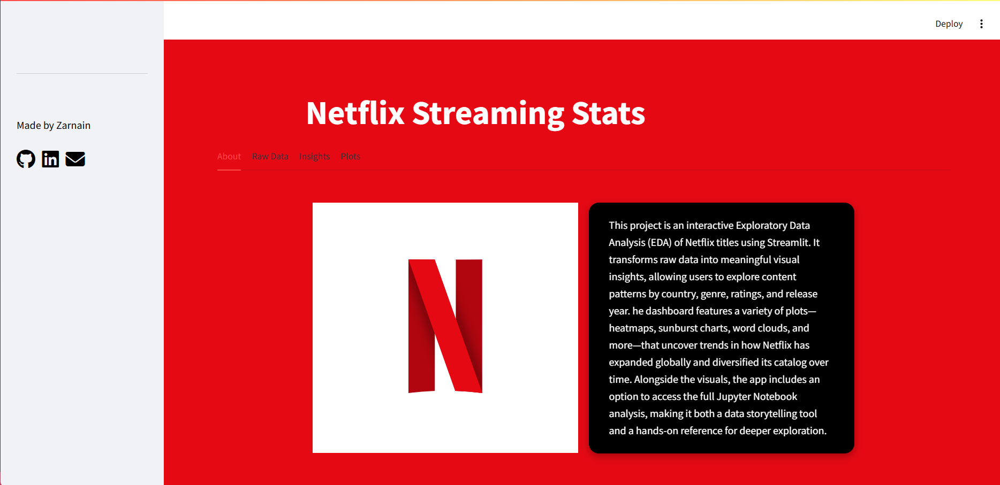
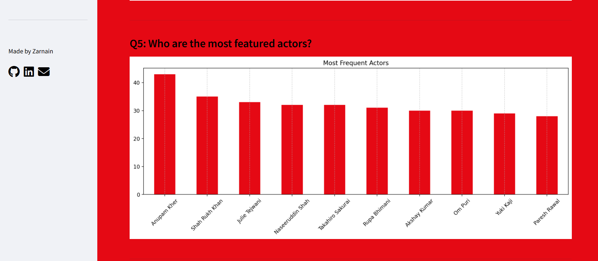
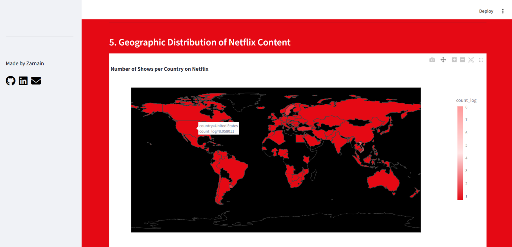

# **STREAMING STATISTICS**

```md
<p align="center">
  
</p>

<h1 align="center"> Netflix Streaming Statistics Dashboard</h1>
<p align="center">An interactive Streamlit dashboard to explore patterns, trends, and insights from the Netflix titles dataset.</p>

---


##  Tech & Tools Used

<p align="center">


</p>

---

##  Dataset


Source: *Netflix Movies and TV Shows Dataset*

---

##  Project Overview

This project explores Netflix content using **interactive visualizations** built in Streamlit.  
It includes trends, genre breakdowns, ratings, season distributions, content type analysis, and country insights.

The dashboard features:

 Light/Dark theme toggle  
 Dynamic Matplotlib + Plotly charts  
 Clean tabs for navigation  
 Netflix-branded visuals  
 Code optimized for real-time exploration

---

##  Features

This interactive dashboard provides a complete and intuitive exploration of Netflix’s global content library. It includes:

### **About Section**

A clean introduction explaining the purpose and scope of the project, giving users context before they begin exploring the data.

### **Raw Data Exploration**
A dedicated section that displays:

• Dataset shape and size
• Column information and data types
• Missing value analysis


### **Insightful Analytics**

The insights section answers major analytical questions about Netflix’s catalogue, such as:

• What types of content dominate the platform?
• How has Netflix grown over the years?
• Which countries produce the most shows and movies?
• Who are the most featured actors and directors?
• How are content ratings distributed?

Each question is paired with well-explained visualizations and interpretations.

### **Advanced Visualizations**

A rich collection of plots highlights different dimensions of the dataset, including:

• Violin plots
• Multiple types of heatmaps (correlation, rating vs. type, genre distribution)
• Stacked bar charts
• Histograms and boxplots
• Venn diagrams
• Word clouds
• Choropleth world maps

These visualizations provide deep insights into genres, countries, durations, ratings, release patterns, and more.
---

##  Project Structure

```

streaming-statistics/
│── data/
│   └── netflix_titles.csv
│
│── notebooks/
│   └── eda_notebook.ipynb
│
│── streamlit_app/
│   └── app.py
│
│── images/  (optional visual exports)
│
│── requirements.txt
│── README.md
│── .gitignore

````

---

##  Installation


Clone the repository:

```bash
git clone https://github.com/ScriptingSiren13/streaming-statistics.git
cd streaming-statistics
````

Install dependencies:

```bash
pip install -r requirements.txt
```

---

##  Usage

Run the Streamlit app:

```bash
streamlit run streamlit_app/app.py
```

Your dashboard will open in your browser at:

```
http://localhost:8501
```

---

##  Sample Dashboard Screens

### 1️ Raw Data Preview


### 2 Insights Preview


### 3 Sankey Diagram Preview


### 4️⃣ Heatmap Example



---


## Repository Info


---

##  Contributing


Feel free to open issues or submit pull requests.

---

##  Connect With Me

<p align="center">Made with passion, data, and Netflix vibes by Zarnain</p>
<p align="center">
  <a href="www.linkedin.com/in/zarnain-723a31325">
    
  </a>
  <a href="https://github.com/ScriptingSiren13">
    
  </a>
</p>

---


